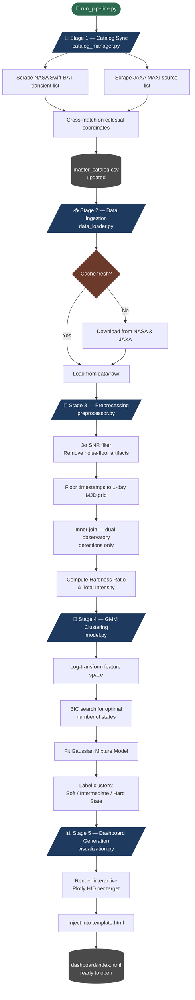
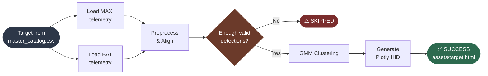

# XRB-HID Engine 🌌
### Unsupervised Black Hole & Neutron Star X-ray Binary Accretion State Classifier

<div align="center">

[](LICENSE)
[](https://www.python.org/)
[](https://scikit-learn.org/)
[](https://plotly.com/)
[](https://swift.gsfc.nasa.gov/results/transients/)
[](http://maxi.riken.jp/)
[](https://shreyashnaha.github.io/XRB-HID-Engine/)

</div>

---

An automated, end-to-end astrophysical pipeline for monitoring **X-ray Binary (XRB)** systems. The engine live cross-matches **NASA Swift-BAT** (hard X-ray, 15–50 keV) and **JAXA MAXI** (soft X-ray, 2–20 keV) archives, fuses their telemetry onto a common daily time grid, and applies an unsupervised **Gaussian Mixture Model (GMM)** to classify accretion states — no training data, no human annotation required.

The output is a fully interactive **Hardness-Intensity Diagram (HID)** dashboard, generated locally for every catalogued system, with each observation coloured by its inferred physical state.

---

## User Interface


## Table of Contents

- [The Science](#the-science)
- [Pipeline Overview](#pipeline-overview)
- [Project Structure](#project-structure)
- [Installation](#installation)
- [Running the Pipeline](#running-the-pipeline)
- [Understanding the Output](#understanding-the-output)
- [Data Sources & Attribution](#data-sources--attribution)
- [License](#license)

---

## The Science

### X-ray Binaries

An **X-ray Binary (XRB)** is a two-body stellar system where a compact object — a **black hole** or **neutron star** — accretes mass from a companion star. The infalling gas forms an **accretion disk** that heats to tens of millions of Kelvin, radiating brilliantly in X-rays. XRBs are among the most luminous X-ray sources in the sky and act as natural laboratories for extreme gravity, relativistic plasma physics, and nuclear matter — regimes unreachable by any terrestrial experiment.

They come in two flavours based on the companion star's mass:

- **HMXBs (High-Mass X-ray Binaries):** Massive OB or Be-type companion. Often persistent or regularly outbursting sources.
- **LMXBs (Low-Mass X-ray Binaries):** Faint, evolved companion. Typically transient — lying dormant in quiescence for years before erupting.

### Accretion States

The structure of the accretion disk and its surrounding **corona** (a hot, diffuse plasma cloud above the disk) evolves throughout an outburst. Astronomers classify this evolution into distinct **accretion states**:

| State | Spectrum | Disk Geometry |
|-------|----------|---------------|
| **Hard State** | Hard, non-thermal (corona-dominated) | Truncated disk, extended corona |
| **Soft State** | Soft, thermal (disk-dominated) | Full disk reaching the innermost stable orbit |
| **Intermediate State** | Mixed | Transitional geometry |

### The Hardness-Intensity Diagram (HID)

The HID is the standard tool for visualising accretion state evolution. It plots:

- **X-axis — Hardness Ratio:** Hard X-ray flux (BAT) divided by soft X-ray flux (MAXI). High = corona-dominated. Low = disk-dominated.
- **Y-axis — Total Intensity:** Sum of both bands — a direct proxy for the **mass accretion rate (Ṁ)**.

**Black hole XRBs** famously trace a counter-clockwise **"Q-shaped" hysteresis loop** during outburst — rising in the hard state, transitioning to the soft state at peak luminosity, declining, and returning to the hard state at a *lower* luminosity than the original transition. This hysteresis tells us that the disk-corona geometry depends on the system's accretion *history*, not just its current rate.

**Neutron star XRBs** display different morphologies — Atoll and Z-track patterns — reflecting their solid surface, magnetic field, and boundary layer emission, all absent in black holes.

### Why Unsupervised ML?

Accretion state boundaries are continuous, source-dependent, and shift with luminosity. A **Gaussian Mixture Model (GMM)** learns the density structure of the HID data directly — no labelled examples, no hardcoded thresholds. It automatically determines how many physical states the data supports and maps each cluster to a canonical state name based on its position along the hardness axis.

---

## Pipeline Overview

Every run executes five stages automatically:



---

### Per-Target Processing Loop

For each system in the catalog, the pipeline runs this loop. Failures and skips are handled gracefully — a single bad source never halts the run.



---

## Project Structure

```
xrb-hid-engine/
│
├── .github/workflows/          # CI/CD automation (GitHub Actions)
│
├── src/
│   ├── config.py               # Directory paths, URLs, ML settings
│   ├── catalog_manager.py      # Live NASA/JAXA cross-matching engine
│   ├── data_loader.py          # Telemetry downloader with local cache
│   ├── preprocessor.py         # 3σ filter, MJD alignment, feature engineering
│   ├── model.py                # GMM clustering + physical state labelling
│   └── visualization.py        # Plotly HID generator + dashboard builder
│
├── data/                       # Auto-created on first run
│   ├── raw/                    # Cached satellite telemetry files
│   └── catalogs/
│       └── master_catalog.csv  # Auto-generated XRB system registry
│
├── dashboard/
│   ├── assets/                 # One interactive .html plot per target
│   ├── css/style.css           # Auto-generated stylesheet
│   ├── template.html           # Dashboard UI blueprint
│   └── index.html              # Auto-generated final dashboard
│
├── run_pipeline.py             # Master orchestrator
└── requirements.txt            # Python dependencies
```

> **Auto-generated files:** `master_catalog.csv` is created/updated at the **start** of every run. `index.html`, `style.css`, and all files under `dashboard/assets/` are created at the **end**, after all targets are processed. None of these are committed to the repository.

---

## Installation

**Requirements:** Python 3.10+

### Option A — Conda (Recommended)

```bash
conda create -n xrb_engine python=3.10 -y
conda activate xrb_engine
pip install -r requirements.txt
```

### Option B — Python venv

```bash
python -m venv venv
source venv/bin/activate      # Windows: venv\Scripts\activate
pip install -r requirements.txt
```

---

## Running the Pipeline

```bash
python run_pipeline.py
```

The orchestrator runs all five stages sequentially with a coloured terminal UI:

```
=== STARTING: Unsupervised Black Hole & Neutron Star XRB HID Clustering Engine ===

[*] Loaded 47 targets from master registry.

[1/47 |  2.1%] Analyzing: 4U 1630-47  (X-Ray Binary)
   ↳ SUCCESS: Interactive plot generated.

[2/47 |  4.3%] Analyzing: GX 339-4  (X-Ray Binary)
   ↳ SKIPPED: No high-confidence overlapping days found for GX 339-4.

...

=== PIPELINE COMPLETE ===
[*] Processed: 39 Successful | 8 Skipped/Dim
[*] All systems nominal. You can now open dashboard/index.html
```

**First run** will take longer as telemetry is downloaded and the catalog is populated from scratch. Subsequent runs use the local cache and complete significantly faster.

**SKIPPED** targets are sources where not enough dual-observatory detections survived the noise filter — typically systems in quiescence or with limited observing coverage. The pipeline continues without interruption.

---

## Understanding the Output

Open the dashboard after the pipeline completes:

```bash
open dashboard/index.html        # macOS
xdg-open dashboard/index.html   # Linux
start dashboard/index.html      # Windows
```

A dropdown lists every successfully processed XRB system. Selecting one loads its HID into the viewer.

### Reading the Diagram

| Element | Meaning |
|---------|---------|
| **X-axis** (log) | Hardness Ratio — moves left as the disk dominates (soft state), right as the corona dominates (hard state) |
| **Y-axis** (log) | Total Intensity — proxy for mass accretion rate Ṁ |
| **Point colour** | GMM-assigned physical state (`Soft State`, `Hard State`, `Intermediate State`) |
| **Connecting lines** | Points linked in time order — the outburst trajectory is a directed path through the diagram |
| **Hover** | Shows the exact MJD date of each observation |

A classic **black hole outburst** traces a counter-clockwise loop — the hysteresis signature. Neutron star systems show Atoll or Z-track morphologies instead. Isolated clusters at low intensity typically represent brief quiescent detections.

---

## Data Sources & Attribution

| Observatory | Instrument | Band | Archive |
|-------------|-----------|------|---------|
| NASA Swift | BAT (Burst Alert Telescope) | 15–50 keV | [Swift-BAT Transient Monitor](https://swift.gsfc.nasa.gov/results/transients/) |
| JAXA MAXI | GSC (Gas Slit Camera) | 2–20 keV | [MAXI Mission Archive](http://maxi.riken.jp/) |

Data is sourced from publicly available archives maintained by NASA HEASARC and the JAXA MAXI mission team. All data remains the property of the respective agencies.

If this pipeline is used in published research, please cite:

- **Swift-BAT Transient Monitor:** Krimm et al. (2013), *ApJS*, 209, 14
- **MAXI/GSC:** Matsuoka et al. (2009), *PASJ*, 61, 999

---

## License

This project is licensed under the **Apache License 2.0** — see [LICENSE](LICENSE) for full terms.

The Apache 2.0 license permits free use, modification, and distribution, requires attribution, and includes an explicit patent grant protecting downstream users. It is the recommended license for open scientific software intended for community use and citation.
